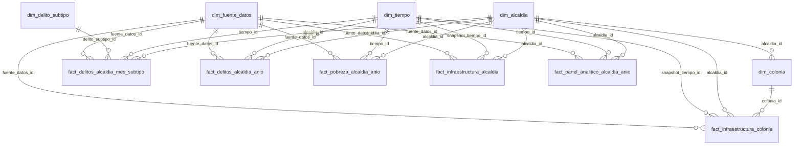

# Mineria de datos CDMX

Proyecto ETL para explorar asociaciones entre pobreza multidimensional, infraestructura urbana y robos patrimoniales por alcaldia de la Ciudad de Mexico. El flujo no prueba causalidad; deja datos listos para EDA, BI, modelos exploratorios y carga futura en PostgreSQL.

## Datasets

Los CSV originales se leen desde `datasets/` y no se modifican. La carpeta `Documentacion/` puede incluir el diccionario MMIP usado para enriquecer `feature_catalog.csv` y `dim_variable_social.csv`.

## Ejecucion

```bash
python scripts/run_etl.py
```

Salidas principales:

- CSV limpios: `data/processed/clean/`.
- CSV analiticos: `data/processed/analytics/`.
- Esquema dimensional: `dimensional_schema/`.
- Scripts SQL: `sql/`.
- Informe breve: `reports/etl_report.md`.

## Limpieza aplicada

El ETL normaliza columnas a `snake_case`, limpia espacios, estandariza alcaldias con `alcaldia_key`, filtra CDMX en pobreza, calcula promedios ponderados por `factor`, procesa FGJ por chunks, clasifica robos patrimoniales por texto de delito y agrega infraestructura de colonia a alcaldia.

Infraestructura se trata como snapshot estructural:

- `infraestructura_actualizacion_anio = 2022`
- `infraestructura_es_snapshot = true`
- `infraestructura_uso_recomendado = "variable estructural contextual; no interpretar como medicion anual"`

## Panel y ML

`data/processed/analytics/modeling_panel.csv` usa grano alcaldia-anio. Incluye ids, target, features sociales, features de infraestructura y controles. No escala ni imputa variables; cualquier imputacion debe hacerse dentro del pipeline de modelado.

## Modelo dimensional

La constelacion separa hechos de delitos, pobreza, infraestructura y panel, conectados por dimensiones compartidas. Para BI territorial usar hechos anuales; para detalle mensual usar `fact_delitos_alcaldia_mes_subtipo`; para ML usar `analytics.modeling_panel` o `dw.fact_panel_analitico_alcaldia_anio`.



## Carga futura en PostgreSQL

Los scripts SQL no se ejecutan automaticamente. Primero crear la base manualmente:

```bash
createdb mineria_cdmx
psql -d mineria_cdmx
```

Desde `psql`, ejecutar en este orden desde la raiz del proyecto:

```sql
\i sql/01_create_schemas.sql
\i sql/02_create_clean_tables.sql
\i sql/03_create_analytics_tables.sql
\i sql/04_create_dimensional_schema.sql
\i sql/05_create_indexes_and_constraints.sql
\i sql/06_copy_clean_csv.sql
\i sql/07_copy_analytics_csv.sql
\i sql/08_copy_dimensional_csv.sql
\i sql/09_validation_queries.sql
```

Alternativa desde terminal:

```bash
psql -d mineria_cdmx -f sql/01_create_schemas.sql
psql -d mineria_cdmx -f sql/02_create_clean_tables.sql
psql -d mineria_cdmx -f sql/03_create_analytics_tables.sql
psql -d mineria_cdmx -f sql/04_create_dimensional_schema.sql
psql -d mineria_cdmx -f sql/05_create_indexes_and_constraints.sql
psql -d mineria_cdmx -f sql/06_copy_clean_csv.sql
psql -d mineria_cdmx -f sql/07_copy_analytics_csv.sql
psql -d mineria_cdmx -f sql/08_copy_dimensional_csv.sql
psql -d mineria_cdmx -f sql/09_validation_queries.sql
```

Los `COPY` usan rutas relativas; deben ejecutarse desde la raiz del proyecto o ajustar las rutas de los CSV.
