# Mineria de datos CDMX

ETL reproducible para explorar asociaciones entre pobreza multidimensional, infraestructura urbana y robos patrimoniales por alcaldia de la Ciudad de Mexico. El proyecto no afirma causalidad; deja datos listos para EDA, BI, ML exploratorio e implementacion posterior en PostgreSQL.

## Fuentes

- `datasets/`: CSV originales, sin modificarlos.
- `Documentacion/`: diccionario MMIP y material complementario si esta disponible.

## Estructura

- `data/processed/clean/`: fuentes limpias.
- `data/processed/analytics/`: panel, agregados y catalogo de features.
- `data/processed/robbery_only/`: FGJ y agregados solo de robos patrimoniales.
- `dimensional_schema/`: dimensiones y hechos para BI/PostgreSQL.
- `sql/`: scripts de creacion, carga y validacion.
- `reports/etl_report.md`: informe breve del ETL.

## Ejecucion

```bash
python scripts/run_etl.py
```

## FGJ general vs robos patrimoniales

`data/processed/clean/fgj_clean.csv` conserva delitos validos de FGJ entre 2016 y 2025. Puede contener `OTRO` para trazabilidad.

`data/processed/robbery_only/fgj_robos_patrimoniales_clean.csv` contiene exclusivamente registros con `is_robo_patrimonial = 1`. `OTRO` no aparece en esta capa ni en hechos de robos patrimoniales.

Los seis subtipos patrimoniales son: `ROBO_A_TRANSEUNTE`, `ROBO_A_NEGOCIO`, `ROBO_A_CASA_HABITACION`, `ROBO_DE_VEHICULO`, `ROBO_DE_ACCESORIOS_AUTO` y `ROBO_DEL_INTERIOR_DE_VEHICULO`.

## Infraestructura

Infraestructura es snapshot estructural 2022:

- `infraestructura_actualizacion_anio = 2022`
- `infraestructura_es_snapshot = true`
- `infraestructura_temporalidad = static_snapshot_2022`

No debe interpretarse como medicion anual.

## Panel y ML

El panel principal usa los anios comunes entre pobreza y FGJ. Si existen, se usan 2016, 2018 y 2020, con meta de 48 filas: 16 alcaldias por 3 anios.

Para EDA usa `data/processed/analytics/panel_alcaldia_anio.csv`. Para ML exploratorio usa `data/processed/analytics/modeling_panel.csv`. El ETL no escala ni imputa silenciosamente. Las columnas derivadas del target se documentan en `feature_catalog.csv` y no se recomiendan como predictores.

## BI y esquema dimensional

Para BI usa `dimensional_schema/`. Para robos mensuales usa `fact_robos_patrimoniales_alcaldia_mes_subtipo`. Para delitos generales de control usa `fact_delitos_generales_alcaldia_anio`.

```mermaid
erDiagram
dim_alcaldia ||--o{ dim_colonia : alcaldia_id
dim_alcaldia ||--o{ fact_delitos_generales_alcaldia_anio : alcaldia_id
dim_tiempo ||--o{ fact_delitos_generales_alcaldia_anio : tiempo_id
dim_fuente_datos ||--o{ fact_delitos_generales_alcaldia_anio : fuente_datos_id
dim_alcaldia ||--o{ fact_robos_patrimoniales_alcaldia_mes_subtipo : alcaldia_id
dim_tiempo ||--o{ fact_robos_patrimoniales_alcaldia_mes_subtipo : tiempo_id
dim_delito_subtipo ||--o{ fact_robos_patrimoniales_alcaldia_mes_subtipo : delito_subtipo_id
dim_fuente_datos ||--o{ fact_robos_patrimoniales_alcaldia_mes_subtipo : fuente_datos_id
dim_alcaldia ||--o{ fact_robos_patrimoniales_alcaldia_anio : alcaldia_id
dim_tiempo ||--o{ fact_robos_patrimoniales_alcaldia_anio : tiempo_id
dim_fuente_datos ||--o{ fact_robos_patrimoniales_alcaldia_anio : fuente_datos_id
dim_alcaldia ||--o{ fact_pobreza_alcaldia_anio : alcaldia_id
dim_tiempo ||--o{ fact_pobreza_alcaldia_anio : tiempo_id
dim_fuente_datos ||--o{ fact_pobreza_alcaldia_anio : fuente_datos_id
dim_alcaldia ||--o{ fact_infraestructura_alcaldia : alcaldia_id
dim_tiempo ||--o{ fact_infraestructura_alcaldia : snapshot_tiempo_id
dim_fuente_datos ||--o{ fact_infraestructura_alcaldia : fuente_datos_id
dim_colonia ||--o{ fact_infraestructura_colonia : colonia_id
dim_alcaldia ||--o{ fact_infraestructura_colonia : alcaldia_id
dim_tiempo ||--o{ fact_infraestructura_colonia : snapshot_tiempo_id
dim_fuente_datos ||--o{ fact_infraestructura_colonia : fuente_datos_id
dim_alcaldia ||--o{ fact_panel_analitico_alcaldia_anio : alcaldia_id
dim_tiempo ||--o{ fact_panel_analitico_alcaldia_anio : tiempo_id
dim_fuente_datos ||--o{ fact_panel_analitico_alcaldia_anio : fuente_datos_id
```



## Carga futura en PostgreSQL

Los scripts SQL no se ejecutan automaticamente. Crear la base manualmente:

```bash
createdb mineria_cdmx
psql -d mineria_cdmx
```

Dentro de `psql`, desde la raiz del proyecto:

```sql
\i sql/01_create_schemas.sql
\i sql/02_create_clean_tables.sql
\i sql/03_create_analytics_tables.sql
\i sql/04_create_dimensional_schema.sql
\i sql/05_create_indexes_and_constraints.sql
\i sql/06_copy_clean_csv.sql
\i sql/07_copy_analytics_csv.sql
\i sql/08_copy_dimensional_csv.sql
\i sql/09_validation_queries.sql
```

Alternativa desde terminal:

```bash
psql -d mineria_cdmx -f sql/01_create_schemas.sql
psql -d mineria_cdmx -f sql/02_create_clean_tables.sql
psql -d mineria_cdmx -f sql/03_create_analytics_tables.sql
psql -d mineria_cdmx -f sql/04_create_dimensional_schema.sql
psql -d mineria_cdmx -f sql/05_create_indexes_and_constraints.sql
psql -d mineria_cdmx -f sql/06_copy_clean_csv.sql
psql -d mineria_cdmx -f sql/07_copy_analytics_csv.sql
psql -d mineria_cdmx -f sql/08_copy_dimensional_csv.sql
psql -d mineria_cdmx -f sql/09_validation_queries.sql
```

Los `COPY` usan rutas relativas y deben ejecutarse desde la raiz del proyecto o ajustar rutas.
