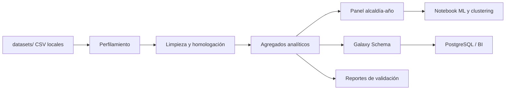

# Pobreza multidimensional, infraestructura urbana y robos patrimoniales en alcaldías de la Ciudad de México

<a id="ejecucion-rapida"></a>
## Ejecución rápida

Este repositorio integra un pipeline reproducible de minería de datos para limpiar, transformar, modelar y analizar información de pobreza multidimensional, infraestructura urbana y robos patrimoniales en alcaldías de la Ciudad de México.

La ejecución principal se resume así:

```bash
git clone https://github.com/LiamSalazar/DMProject.git
cd DMProject
```

Crear entorno en Windows PowerShell:

```powershell
python -m venv .venv
.venv\Scripts\Activate.ps1
```

Crear entorno en Linux/macOS:

```bash
python3 -m venv .venv
source .venv/bin/activate
```

Instalar dependencias:

```bash
python -m pip install --upgrade pip
python -m pip install -r requirements.txt
```

Validar sintaxis de scripts:

```bash
python -m compileall scripts
```

Preparar datos:

```bash
mkdir datasets
```

En `datasets/` deben colocarse los archivos fuente pesados que no se versionan en GitHub. El ETL detecta automáticamente los CSV de pobreza, infraestructura y FGJ a partir de sus columnas.

Ejecutar ETL:

```bash
python scripts/run_etl.py
```

Revisar reportes:

```bash
cat reports/etl_report.md
```

<a id="requisitos-previos"></a>
## Requisitos previos

- Python 3.10 o superior recomendado.
- Git para clonar el repositorio.
- PostgreSQL y cliente `psql` si se desea cargar el modelo en base de datos.
- Jupyter Notebook, JupyterLab o VS Code con soporte de notebooks para ejecutar `notebooks/modelo_predictivo_robos.ipynb`.
- Memoria y espacio suficientes para procesar los archivos fuente grandes de FGJ y ENIGH/MMIP.

<a id="instalacion"></a>
## Instalación

Desde la raíz del repositorio, crear y activar el entorno virtual, instalar dependencias y validar la sintaxis:

```bash
python -m pip install --upgrade pip
python -m pip install -r requirements.txt
python -m compileall scripts
```

Las dependencias principales son `pandas`, `numpy`, `openpyxl`, `matplotlib`, `seaborn`, `scikit-learn`, `statsmodels`, `scipy` y `jupyter`.

<a id="preparacion-de-datos-locales"></a>
## Preparación de datos locales

La carpeta `datasets/` está ignorada por `.gitignore` porque contiene archivos fuente pesados o descargados localmente. Para reproducir el ETL desde cero, crear la carpeta y colocar ahí los CSV originales:

```bash
mkdir datasets
```

Archivos esperados localmente:

- `datasets/enigh_16_20.csv`: fuente social de pobreza multidimensional/MMIP.
- `datasets/carpetasFGJ_acumulado_2025_01.csv`: carpetas de investigación de FGJ-CDMX, con corte al 31 de enero de 2025.
- `datasets/infraestructura.csv`: infraestructura urbana derivada del SHP original y procesada a CSV.

Los nombres exactos pueden variar si las columnas permiten la detección automática. El script `scripts/etl_common.py` clasifica los archivos por estructura: FGJ, pobreza e infraestructura.

<a id="ejecucion-del-etl"></a>
## Ejecución del ETL

El orquestador ejecuta todas las fases en orden:

```bash
python scripts/run_etl.py
```

Orden interno:

1. `scripts/01_profile_raw_data.py`
2. `scripts/02_clean_sources.py`
3. `scripts/03_build_analytics_panel.py`
4. `scripts/04_build_dimensional_schema.py`
5. `scripts/05_generate_postgres_sql.py`
6. `scripts/06_validate_outputs.py`

Al terminar, revisar:

```bash
cat reports/etl_report.md
```

Si el ETL falla indicando que no detectó datasets requeridos, no es necesariamente un error del código: significa que faltan CSV fuente en `datasets/` o que sus columnas no corresponden con las fuentes esperadas.

<a id="ejecucion-consulta-postgresql"></a>
## Ejecución/consulta en PostgreSQL

Carga futura en PostgreSQL: esta sección documenta el orden reproducible de creación, carga y validación.

Crear la base de datos:

```bash
createdb mineria_cdmx
psql -d mineria_cdmx
```

Dentro de `psql`, desde la raíz del proyecto:

```sql
\i sql/01_create_schemas.sql
\i sql/02_create_clean_tables.sql
\i sql/03_create_analytics_tables.sql
\i sql/04_create_dimensional_schema.sql
\i sql/05_create_indexes_and_constraints.sql
\i sql/06_copy_clean_csv.sql
\i sql/07_copy_analytics_csv.sql
\i sql/08_copy_dimensional_csv.sql
\i sql/09_validation_queries.sql
```

Alternativa desde terminal:

```bash
psql -d mineria_cdmx -f sql/01_create_schemas.sql
psql -d mineria_cdmx -f sql/02_create_clean_tables.sql
psql -d mineria_cdmx -f sql/03_create_analytics_tables.sql
psql -d mineria_cdmx -f sql/04_create_dimensional_schema.sql
psql -d mineria_cdmx -f sql/05_create_indexes_and_constraints.sql
psql -d mineria_cdmx -f sql/06_copy_clean_csv.sql
psql -d mineria_cdmx -f sql/07_copy_analytics_csv.sql
psql -d mineria_cdmx -f sql/08_copy_dimensional_csv.sql
psql -d mineria_cdmx -f sql/09_validation_queries.sql
```

Advertencia: los scripts `COPY` usan rutas relativas. Deben ejecutarse desde la raíz del proyecto o ajustarse según la ubicación local de los archivos CSV.

Script destructivo: `sql/10_drop_all.sql` elimina los esquemas `dw`, `analytics` y `clean` con `CASCADE`. Usarlo solo si se desea borrar todos los objetos generados por el proyecto en PostgreSQL.

<a id="ejecucion-notebook-modelos"></a>
## Ejecución del notebook/modelos

El notebook principal es `notebooks/modelo_predictivo_robos.ipynb`. Puede ejecutarse localmente después del ETL porque espera:

- `../data/processed/analytics/modeling_panel.csv`
- `../data/processed/analytics/feature_catalog.csv`

Si se usa Google Colab, montar o subir el repositorio completo y ajustar el directorio de trabajo para que las rutas relativas apunten a la raíz del proyecto o a `notebooks/`. El notebook usa Random Forest, regresión lineal, análisis de importancia de variables y clustering exploratorio.

<a id="indice"></a>
## Índice

- [Resumen](#resumen)
- [Descripción completa del proyecto](#descripcion-completa-del-proyecto)
- [Problema, objetivos, preguntas de investigación y alcance](#problema-objetivos-preguntas-investigacion-alcance)
- [Fuentes de datos](#fuentes-de-datos)
- [Arquitectura de minería de datos](#arquitectura-de-mineria-de-datos)
- [Metodología CRISP-DM](#metodologia-crisp-dm)
- [Proceso ETL](#proceso-etl)
- [Modelo multidimensional / Galaxy Schema](#modelo-multidimensional-galaxy-schema)
- [Outputs generados](#outputs-generados)
- [Consultas SQL y validaciones](#consultas-sql-y-validaciones)
- [Machine Learning y clustering exploratorio](#machine-learning-clustering-exploratorio)
- [Dashboard y visualizaciones](#dashboard-visualizaciones)
- [Resultados principales](#resultados-principales)
- [Limitaciones, supuestos y advertencia de no causalidad](#limitaciones-supuestos-advertencia-no-causalidad)
- [Estructura del repositorio](#estructura-del-repositorio)
- [Archivos ignorados por .gitignore](#archivos-ignorados-gitignore)
- [Solución de problemas frecuentes](#solucion-problemas-frecuentes)
- [Créditos del equipo](#creditos-del-equipo)

<a id="resumen"></a>
## Resumen

El proyecto diseña una arquitectura completa de minería de datos para integrar tres dimensiones territoriales de la Ciudad de México: pobreza multidimensional, infraestructura urbana y robos patrimoniales registrados por carpetas de investigación.

El flujo produce capas limpias, agregados analíticos, un panel alcaldía-año, un modelo dimensional tipo constelación o Galaxy Schema, scripts de carga para PostgreSQL, reportes de validación y un notebook de modelado exploratorio.

Este proyecto identifica patrones y asociaciones estadísticas exploratorias. Los resultados no deben interpretarse como causalidad directa entre pobreza, infraestructura y robos patrimoniales.

<a id="descripcion-completa-del-proyecto"></a>
## Descripción completa del proyecto

El proyecto “Pobreza multidimensional, infraestructura urbana y robos patrimoniales en alcaldías de la Ciudad de México” forma parte del curso Minería de Datos, grupo 5AM1, de la Escuela Superior de Cómputo del Instituto Politécnico Nacional.

El propósito técnico es construir una base reproducible para análisis territorial, seguridad pública y desarrollo urbano. Para ello se integran fuentes heterogéneas en distintos niveles de granularidad:

- FGJ-CDMX: registros delictivos con detalle temporal y territorial.
- Pobreza multidimensional/MMIP: indicadores sociales por persona u hogar que se agregan a alcaldía-año.
- Infraestructura urbana: variables por colonia que se agregan a colonia y alcaldía como fotografía estructural de 2022.

El resultado central es `data/processed/analytics/modeling_panel.csv`, con grano alcaldía-año, y el conjunto `dimensional_schema/`, diseñado para consulta analítica, BI y carga en PostgreSQL.

<a id="problema-objetivos-preguntas-investigacion-alcance"></a>
## Problema, objetivos, preguntas de investigación y alcance

El problema consiste en organizar fuentes sociales, urbanas y delictivas para explorar cómo se distribuyen los robos patrimoniales en el territorio y qué variables contextuales pueden asociarse con su concentración.

Objetivo general:

Diseñar y documentar una arquitectura de minería de datos que permita integrar, limpiar, transformar, almacenar, analizar y visualizar información sobre pobreza multidimensional, infraestructura urbana y robos patrimoniales en alcaldías de la Ciudad de México.

Objetivos específicos:

- Homologar nombres de alcaldías y llaves territoriales.
- Limpiar y perfilar fuentes de entrada.
- Seleccionar robos patrimoniales a partir de delitos FGJ.
- Construir agregados anuales, mensuales y por subtipo.
- Calcular indicadores sociales ponderados con factor de expansión.
- Integrar infraestructura como variable contextual estructural.
- Generar un panel alcaldía-año para análisis exploratorio y modelos base.
- Diseñar un Galaxy Schema para consultas OLAP y BI.
- Documentar la carga en PostgreSQL y las validaciones reproducibles.

Preguntas de investigación:

- ¿Qué alcaldías concentran más robos patrimoniales en la ventana 2016-2025?
- ¿Qué subtipo de robo predomina por alcaldía?
- ¿Cómo cambia la incidencia de robos por año?
- ¿Qué relación exploratoria existe entre iluminación promedio y robos patrimoniales?
- ¿Qué alcaldías combinan alto NBI y alta incidencia de robos?
- ¿Qué zonas concentran más actividad urbana medida por mercados, locales o residuos?

Alcance:

- El análisis trabaja con alcaldías de la Ciudad de México.
- FGJ se filtra al periodo 2016-2025.
- Pobreza se trabaja principalmente para 2016, 2018 y 2020.
- Infraestructura se usa como snapshot estático de 2022.
- El modelado predictivo es exploratorio y no debe usarse como predicción definitiva de criminalidad.

<a id="fuentes-de-datos"></a>
## Fuentes de datos

### Carpetas de investigación FGJ-CDMX

Fuente delictiva en formato CSV. Contiene delitos, fechas, año, mes, alcaldía, colonia, latitud, longitud y categoría delictiva. La cobertura trabajada es 2016-2025, con corte al 31 de enero de 2025.

El ETL conserva una capa de delitos generales de control y deriva una capa exclusiva de robos patrimoniales. Los seis subtipos patrimoniales usados son:

- `ROBO_A_TRANSEUNTE`
- `ROBO_A_NEGOCIO`
- `ROBO_A_CASA_HABITACION`
- `ROBO_DE_VEHICULO`
- `ROBO_DE_ACCESORIOS_AUTO`
- `ROBO_DEL_INTERIOR_DE_VEHICULO`

La capa general puede clasificar registros como `OTRO` para trazabilidad. La capa `robbery_only` y los hechos de robos patrimoniales no incluyen `OTRO`.

#### FGJ general vs robos patrimoniales

`data/processed/clean/fgj_clean.csv` conserva delitos válidos de FGJ entre 2016 y 2025 y funciona como fuente de control general. `data/processed/robbery_only/fgj_robos_patrimoniales_clean.csv` contiene únicamente registros clasificados con `is_robo_patrimonial = 1`.

### Indicadores de pobreza multidimensional / MMIP

Fuente social en formato CSV. Los años principales son 2016, 2018 y 2020. Incluye variables como `mmip`, `nbi`, `rei`, `casi`, `cassi`, `cyt` y otros componentes sociales.

Los indicadores por alcaldía-año se calculan mediante promedios ponderados con `factor`, no como promedios simples. Por ejemplo, `mmip_wmean` y `nbi_wmean` representan agregaciones ponderadas por factor de expansión.

### Nivel de servicios básicos y equipamiento por colonia

Fuente de infraestructura urbana. El insumo original proviene de SHP y se procesa a CSV para el ETL. Es un corte transversal de 2022 con variables de alumbrado público, agua, electricidad, drenaje, residuos, mercados, locales, equipamiento educativo y equipamiento de salud.

La infraestructura se usa como variable contextual o estructural, no como medición anual. En el pipeline se documenta como snapshot estructural 2022:

- `infraestructura_actualizacion_anio = 2022`
- `infraestructura_es_snapshot = true`
- `infraestructura_temporalidad = static_snapshot_2022`

<a id="arquitectura-de-mineria-de-datos"></a>
## Arquitectura de minería de datos

La arquitectura se organiza por capas:

- Entrada local: `datasets/` y `Documentacion/`.
- Limpieza: `data/processed/clean/`.
- Agregados analíticos: `data/processed/analytics/` y `data/processed/robbery_only/`.
- Modelo dimensional: `dimensional_schema/`.
- SQL reproducible: `sql/`.
- Reportes y metadatos: `reports/`.
- Modelado exploratorio: `notebooks/modelo_predictivo_robos.ipynb`.

Flujo conceptual:



<a id="metodologia-crisp-dm"></a>
## Metodología CRISP-DM

1. Comprensión del problema: se define el fenómeno territorial a explorar y se delimita el uso no causal de las asociaciones.
2. Comprensión de los datos: se perfilan fuentes, columnas, codificaciones, granularidades y cobertura temporal.
3. Preparación de datos: se limpian textos, se normalizan alcaldías, se filtran años válidos, se manejan nulos y se generan variables derivadas.
4. Modelado multidimensional: se construye una constelación de hechos conectada por dimensiones compartidas.
5. Análisis exploratorio y visualización: se generan agregados para rankings, evolución temporal, mapas, heatmaps y comparaciones de variables.
6. Modelado predictivo exploratorio: se usa el panel para Random Forest, regresión y clustering, con advertencia por tamaño reducido.
7. Evaluación, documentación y limitaciones: se validan salidas, llaves, granos, archivos SQL y supuestos metodológicos.

<a id="proceso-etl"></a>
## Proceso ETL

El ETL realiza:

- Ingesta de fuentes desde `datasets/`.
- Perfilamiento inicial y generación de `reports/raw_profile.json`.
- Limpieza de columnas y normalización a `snake_case`.
- Normalización de nombres de alcaldías.
- Homologación territorial a 16 alcaldías canónicas.
- Manejo de nulos y codificaciones robustas.
- Filtrado temporal de FGJ a 2016-2025.
- Selección de robos patrimoniales mediante clasificación por subtipo.
- Agregación de infraestructura de colonia a alcaldía.
- Cálculo de indicadores sociales ponderados con factor de expansión.
- Construcción del panel alcaldía-año.
- Generación del modelo dimensional.
- Generación de SQL para PostgreSQL.
- Validación de outputs, llaves, granos, UTF-8 y consistencia de columnas.

### Scripts

`scripts/01_profile_raw_data.py` recibe los CSV locales de `datasets/`, detecta cuáles corresponden a FGJ, pobreza e infraestructura, perfila columnas, filas, codificación y tamaño, y genera `reports/raw_profile.json` junto con metadatos en `reports/etl_metadata.json`.

`scripts/02_clean_sources.py` recibe las fuentes detectadas, limpia pobreza, infraestructura y FGJ, normaliza alcaldías, filtra años válidos, clasifica robos patrimoniales y genera las capas limpias y agregados iniciales. Depende de los datos locales pesados en `datasets/`. Genera, entre otros, `pobreza_clean.csv`, `infraestructura_clean.csv`, `fgj_clean.csv`, `fgj_robos_patrimoniales_clean.csv`, `delitos_alcaldia_anio.csv`, `robos_patrimoniales_alcaldia_mes_subtipo.csv` y `robos_patrimoniales_alcaldia_anio.csv`.

`scripts/03_build_analytics_panel.py` recibe agregados de pobreza, infraestructura, delitos generales y robos patrimoniales. Construye `panel_alcaldia_anio.csv`, `modeling_panel.csv`, `feature_catalog.csv`, `modeling_panel_readme.md` y `reports/modeling_panel_nulls.csv`. Participa en la fase analítica y documenta variables objetivo, variables recomendadas y posibles riesgos de fuga de información.

`scripts/04_build_dimensional_schema.py` recibe capas analíticas y limpias. Genera dimensiones y hechos en `dimensional_schema/`, además de `dimensional_schema/README.md`. Participa en la fase de modelado dimensional y usa datos ya procesados.

`scripts/05_generate_postgres_sql.py` recibe los CSV limpios, analíticos y dimensionales. Infere tipos SQL, crea scripts de creación, carga, índices, restricciones, validación y borrado en `sql/`. No carga PostgreSQL automáticamente. El script preserva el `README.md` maestro si ya existe.

`scripts/06_validate_outputs.py` recibe las salidas generadas por el ETL. Valida existencia de archivos, UTF-8, columnas `snake_case`, llaves, duplicados por grano, relaciones con dimensiones, ausencia de `OTRO` en robos patrimoniales, snapshot de infraestructura y referencias SQL. Genera `reports/etl_report.md`.

`scripts/etl_common.py` concentra constantes, rutas, catálogos de alcaldías, variables sociales, variables de infraestructura, clasificación de robos patrimoniales, lectura robusta de CSV, escritura UTF-8 y utilidades compartidas.

`scripts/run_etl.py` orquesta todos los scripts anteriores en secuencia y detiene la ejecución si una fase falla.

<a id="modelo-multidimensional-galaxy-schema"></a>
## Modelo multidimensional / Galaxy Schema

El modelo dimensional se diseñó como esquema tipo constelación o Galaxy Schema porque integra varios procesos de análisis: delitos generales, robos patrimoniales, pobreza, infraestructura y panel analítico.

Dimensiones:

- `dim_alcaldia`
- `dim_colonia`
- `dim_tiempo`
- `dim_delito_subtipo`
- `dim_fuente_datos`
- `dim_variable_social`
- `dim_variable_infraestructura`

Tablas de hechos:

- `fact_delitos_generales_alcaldia_anio`
- `fact_robos_patrimoniales_alcaldia_mes_subtipo`
- `fact_robos_patrimoniales_alcaldia_anio`
- `fact_pobreza_alcaldia_anio`
- `fact_infraestructura_alcaldia`
- `fact_infraestructura_colonia`
- `fact_panel_analitico_alcaldia_anio`

Operaciones OLAP:

- Roll-up: agregar robos de mes a año o de colonia a alcaldía.
- Drill-down: bajar de alcaldía-año a alcaldía-mes-subtipo.
- Slice: seleccionar un año, una alcaldía o un subtipo específico.
- Dice: combinar filtros, por ejemplo año 2018, alcaldías con alto NBI y subtipo `ROBO_A_NEGOCIO`.
- Pivot: reorganizar subtipos como columnas para comparar patrones territoriales.

Ejemplos de preguntas OLAP:

- ¿Qué alcaldía tuvo más robos patrimoniales en 2018?
- ¿Qué subtipo de robo predomina en cada alcaldía?
- ¿Cómo cambia la incidencia por año?
- ¿Qué relación exploratoria existe entre iluminación promedio y robos patrimoniales?
- ¿Qué alcaldías combinan alto NBI y alta incidencia de robos?
- ¿Qué zonas concentran más actividad urbana medida por mercados, locales o residuos?

<a id="outputs-generados"></a>
## Outputs generados

Archivos limpios:

- `data/processed/clean/pobreza_clean.csv`: versionado, fuente social limpia.
- `data/processed/clean/infraestructura_clean.csv`: versionado, infraestructura limpia por colonia.
- `data/processed/clean/fgj_clean.csv`: generado localmente e ignorado por tamaño.

Agregados analíticos:

- `data/processed/analytics/pobreza_alcaldia_anio.csv`
- `data/processed/analytics/infraestructura_alcaldia.csv`
- `data/processed/analytics/delitos_alcaldia_anio.csv`
- `data/processed/analytics/panel_alcaldia_anio.csv`
- `data/processed/analytics/modeling_panel.csv`
- `data/processed/analytics/feature_catalog.csv`
- `data/processed/analytics/modeling_panel_readme.md`

Capa de robos patrimoniales:

- `data/processed/robbery_only/fgj_robos_patrimoniales_clean.csv`: generado localmente e ignorado por tamaño.
- `data/processed/robbery_only/robos_patrimoniales_alcaldia_mes_subtipo.csv`
- `data/processed/robbery_only/robos_patrimoniales_alcaldia_anio.csv`

Dimensiones:

- `dimensional_schema/dim_alcaldia.csv`
- `dimensional_schema/dim_colonia.csv`
- `dimensional_schema/dim_tiempo.csv`
- `dimensional_schema/dim_delito_subtipo.csv`
- `dimensional_schema/dim_fuente_datos.csv`
- `dimensional_schema/dim_variable_social.csv`
- `dimensional_schema/dim_variable_infraestructura.csv`

Hechos:

- `dimensional_schema/fact_delitos_generales_alcaldia_anio.csv`
- `dimensional_schema/fact_robos_patrimoniales_alcaldia_mes_subtipo.csv`
- `dimensional_schema/fact_robos_patrimoniales_alcaldia_anio.csv`
- `dimensional_schema/fact_pobreza_alcaldia_anio.csv`
- `dimensional_schema/fact_infraestructura_alcaldia.csv`
- `dimensional_schema/fact_infraestructura_colonia.csv`
- `dimensional_schema/fact_panel_analitico_alcaldia_anio.csv`

Reportes:

- `reports/raw_profile.json`
- `reports/etl_metadata.json`
- `reports/modeling_panel_nulls.csv`
- `reports/etl_report.md`

<a id="consultas-sql-y-validaciones"></a>
## Consultas SQL y validaciones

Los scripts SQL se ejecutan en este orden:

- `sql/00_create_database_notes.md`: notas para crear manualmente la base `mineria_cdmx`.
- `sql/01_create_schemas.sql`: crea los esquemas `clean`, `analytics` y `dw`.
- `sql/02_create_clean_tables.sql`: crea tablas de la capa limpia.
- `sql/03_create_analytics_tables.sql`: crea tablas de la capa analítica.
- `sql/04_create_dimensional_schema.sql`: crea dimensiones y hechos en `dw`.
- `sql/05_create_indexes_and_constraints.sql`: agrega llaves primarias, foráneas, restricciones únicas e índices.
- `sql/06_copy_clean_csv.sql`: carga CSV limpios con `\copy`.
- `sql/07_copy_analytics_csv.sql`: carga CSV analíticos con `\copy`.
- `sql/08_copy_dimensional_csv.sql`: carga CSV dimensionales con `\copy`.
- `sql/09_validation_queries.sql`: ejecuta conteos y validaciones posteriores a la carga.
- `sql/10_drop_all.sql`: script destructivo que borra los esquemas generados. Usar con extrema precaución.

Validaciones relevantes del ETL:

- 16 alcaldías canónicas en `dim_alcaldia`.
- 6 subtipos de robo patrimonial, sin `OTRO`.
- FGJ filtrado a 2016-2025.
- Panel principal con 48 filas cuando existen 2016, 2018 y 2020 para 16 alcaldías.
- Infraestructura marcada como snapshot 2022.
- Hechos sin duplicados en su grano.
- Llaves foráneas compatibles con dimensiones.
- Columnas en `snake_case` y archivos UTF-8.

<a id="machine-learning-clustering-exploratorio"></a>
## Machine Learning y clustering exploratorio

El notebook `notebooks/modelo_predictivo_robos.ipynb` usa como entrada principal `data/processed/analytics/modeling_panel.csv` y como referencia `data/processed/analytics/feature_catalog.csv`.

Objetivo del notebook:

- Explorar relaciones entre variables sociales, infraestructura y robos patrimoniales.
- Probar modelos base como Random Forest y regresión lineal.
- Revisar importancia de variables.
- Construir perfiles o clusters exploratorios de riesgo bajo, medio y alto.

Variable objetivo:

- `target_robos_patrimoniales_total`

Variables usadas:

- Indicadores sociales ponderados como `mmip_wmean`, `nbi_wmean`, `rei_wmean`, `casi_wmean`, `cassi_wmean` y `cyt_wmean`.
- Indicadores urbanos como `mercados_total`, `locales_total`, `iluminacion_promedio`, `residuos_ton_total`, `agua_potable_promedio`, `electricidad_promedio` y `drenaje_promedio`.
- Variables de control y metadatos documentadas en `feature_catalog.csv`.

Limitaciones del modelo:

- El panel principal tiene tamaño reducido: 16 alcaldías por 3 años principales.
- Algunas variables son derivadas del target o del mismo año y no deben usarse como predictores sin revisar fuga de información.
- El Random Forest y los clusters son herramientas exploratorias, no predicciones definitivas.
- Los perfiles de riesgo son una clasificación analítica para comparación territorial, no una sentencia causal ni operacional.

Salidas esperadas del notebook, si se ejecutan las celdas de exportación:

- `data/processed/analytics/clustering_resultados.csv`
- `data/processed/analytics/importancia_variables.csv`

Estas salidas pueden regenerarse localmente y no son necesarias para correr el ETL.

<a id="dashboard-visualizaciones"></a>
## Dashboard y visualizaciones

No existen imágenes ligeras versionadas en `assets/`, `images/`, `reports/figures/` u otra carpeta equivalente. Para evitar enlaces rotos, este README no incrusta imágenes.

Las visualizaciones completas se consultan en el PDF/dashboard de Power BI del proyecto. El dashboard incluye:

- Total de robos patrimoniales.
- Ranking de alcaldías por robos patrimoniales.
- Distribución territorial en mapa.
- Robos por subtipo.
- Evolución anual.
- Evolución mensual.
- Heatmap alcaldía-año.
- Iluminación promedio vs robos patrimoniales.
- Residuos sólidos vs robos.
- NBI vs robos.
- Mercados vs robos.
- Importancia de variables.
- Perfiles de riesgo bajo, medio y alto.
- Dispersión de clusters.

<a id="resultados-principales"></a>
## Resultados principales

Los robos patrimoniales no se distribuyen de manera uniforme entre alcaldías.

En los agregados 2016-2025, las alcaldías con mayor acumulación observada incluyen Cuauhtémoc, Iztapalapa, Gustavo A. Madero, Benito Juárez, Coyoacán, Miguel Hidalgo y Álvaro Obregón. Milpa Alta, Cuajimalpa de Morelos y La Magdalena Contreras aparecen con valores bajos.

El año 2018 muestra el volumen más alto dentro de la ventana analizada. El año 2020 muestra una reducción importante; puede interpretarse como una posible relación con menor movilidad, pero no como causalidad demostrada.

Mercados, locales y residuos pueden funcionar como indicadores indirectos de actividad urbana. En el panel exploratorio, `residuos_ton_total`, `mercados_total` y `locales_total` muestran asociaciones positivas con el target, mientras que `iluminacion_promedio` presenta una asociación exploratoria negativa.

Las variables sociales como `nbi_wmean` aportan contexto territorial, pero no explican por sí solas el fenómeno. El modelo de Machine Learning es exploratorio y los perfiles de riesgo son una herramienta de clasificación analítica, no una predicción definitiva de criminalidad.

<a id="limitaciones-supuestos-advertencia-no-causalidad"></a>
## Limitaciones, supuestos y advertencia de no causalidad

Este proyecto identifica patrones y asociaciones estadísticas exploratorias. Los resultados no deben interpretarse como causalidad directa entre pobreza, infraestructura y robos patrimoniales.

Limitaciones:

- Las carpetas de investigación no equivalen necesariamente a todos los delitos ocurridos.
- Puede existir subregistro o variación en denuncia por alcaldía, año o tipo de delito.
- Infraestructura es un snapshot 2022 y no una serie anual.
- El panel principal integra años comunes de pobreza y FGJ, principalmente 2016, 2018 y 2020.
- El tamaño del panel limita el poder estadístico de modelos predictivos.
- No se calculan tasas por población si no existe un denominador poblacional defendible en el pipeline.
- Las coordenadas fuera de rango aproximado se reportan, no se usan para afirmar hallazgos geográficos finos.

<a id="estructura-del-repositorio"></a>
## Estructura del repositorio

- `Documentacion/`: diccionario MMIP y materiales complementarios. Actualmente incluye `diccionario-indicadores-mmip-2008-2016.xlsx`.
- `data/processed/`: salidas procesadas ligeras y reproducibles.
- `data/processed/clean/`: fuentes limpias. Los CSV pesados de FGJ pueden generarse localmente y estar ignorados.
- `data/processed/analytics/`: paneles, agregados, catálogo de variables y archivos listos para EDA/ML.
- `data/processed/robbery_only/`: capa y agregados exclusivos de robos patrimoniales.
- `dimensional_schema/`: dimensiones, hechos y documentación del Galaxy Schema.
- `notebooks/`: notebook de modelado predictivo y clustering exploratorio.
- `reports/`: perfiles, metadatos, nulos y reporte del ETL.
- `scripts/`: pipeline ETL reproducible.
- `sql/`: scripts de creación, carga, validación y borrado para PostgreSQL.
- `README.md`: documentación principal del proyecto.
- `.gitignore`: reglas para excluir datasets pesados, exportaciones y temporales.
- `requirements.txt`: dependencias Python necesarias.

<a id="archivos-ignorados-gitignore"></a>
## Archivos ignorados por `.gitignore`

La configuración actual ignora:

- `datasets/`: contiene archivos fuente pesados o descargados localmente. No debe versionarse.
- `datasets/enigh_16_20.csv`: ejemplo de fuente social esperada localmente, no versionada.
- `datasets/carpetasFGJ_acumulado_2025_01.csv`: ejemplo de fuente FGJ esperada localmente, no versionada.
- `csv_tableau/`: exportaciones de visualización que pueden regenerarse.
- `data/processed/clean/fgj_clean.csv`: salida pesada generada por el ETL.
- `data/processed/robbery_only/fgj_robos_patrimoniales_clean.csv`: salida pesada generada por el ETL.
- `__pycache__/`, `*.py[cod]`, `*$py.class`: temporales de Python.
- `.ipynb_checkpoints/`: temporales de Jupyter.

Los entornos virtuales como `.venv/` no deben versionarse. Si se crean localmente y no aparecen en `.gitignore`, se recomienda mantenerlos fuera del control de versiones.

Los archivos pesados generados localmente deben regenerarse con:

```bash
python scripts/run_etl.py
```

<a id="solucion-problemas-frecuentes"></a>
## Solución de problemas frecuentes

`FileNotFoundError: No se detectaron datasets requeridos en datasets/`

Colocar los CSV fuente en `datasets/` y verificar que sus columnas correspondan a FGJ, pobreza e infraestructura.

`psql` no encuentra los CSV durante `\copy`

Ejecutar los scripts desde la raíz del proyecto o editar las rutas relativas en `sql/06_copy_clean_csv.sql`, `sql/07_copy_analytics_csv.sql` y `sql/08_copy_dimensional_csv.sql`.

El notebook no encuentra `modeling_panel.csv`

Ejecutar primero `python scripts/run_etl.py`. Si se abre el notebook desde otra carpeta, ajustar el directorio de trabajo para que `data/processed/analytics/modeling_panel.csv` sea accesible desde la raíz del repositorio.

Los CSV grandes no aparecen en GitHub

Es esperado. `datasets/`, `fgj_clean.csv` y `fgj_robos_patrimoniales_clean.csv` están ignorados por tamaño y deben existir o regenerarse localmente.

Se necesita limpiar PostgreSQL

Usar `sql/10_drop_all.sql` solo si se desea borrar todos los esquemas generados por el proyecto:

```bash
psql -d mineria_cdmx -f sql/10_drop_all.sql
```

<a id="creditos-del-equipo"></a>
## Créditos del equipo

Instituto Politécnico Nacional, Escuela Superior de Cómputo, Minería de Datos, grupo 5AM1.

Profesor: Roberto Zagal.

Integrantes:

- Antonio Zavala Julio César
- Rodríguez Matamoros Carlo Alejandro
- Salazar Martínez Liam Antonio
- Vargas Nicolás Bianca Celeste
