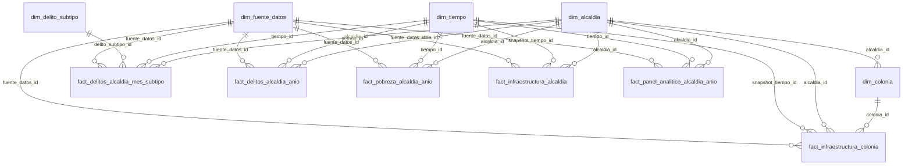

# Esquema dimensional

Este modelo usa una constelacion de hechos: delitos, pobreza, infraestructura y panel analitico se guardan como hechos separados que comparten dimensiones de alcaldia, tiempo, fuente y, cuando aplica, colonia o subtipo de delito.

## Uso recomendado

- BI territorial: `fact_delitos_alcaldia_anio`, `fact_pobreza_alcaldia_anio` y `fact_infraestructura_alcaldia`.
- Analisis mensual: `fact_delitos_alcaldia_mes_subtipo`.
- Analisis por colonia: `fact_infraestructura_colonia`.
- ML exploratorio: `analytics.modeling_panel` o `dw.fact_panel_analitico_alcaldia_anio`.

Infraestructura es un snapshot 2022: `infraestructura_actualizacion_anio = 2022`, `infraestructura_es_snapshot = true` e `infraestructura_uso_recomendado = "variable estructural contextual; no interpretar como medicion anual"`. No debe interpretarse como medicion anual.

## Grano de hechos

- `fact_delitos_alcaldia_mes_subtipo`: alcaldia, mes y subtipo.
- `fact_delitos_alcaldia_anio`: alcaldia y anio.
- `fact_pobreza_alcaldia_anio`: alcaldia y anio.
- `fact_infraestructura_alcaldia`: alcaldia con snapshot 2022.
- `fact_infraestructura_colonia`: colonia con snapshot 2022.
- `fact_panel_analitico_alcaldia_anio`: alcaldia y anio.

Las llaves primarias son surrogate keys enteras en dimensiones. Las tablas de hechos referencian esas llaves con `alcaldia_id`, `tiempo_id`, `snapshot_tiempo_id`, `colonia_id`, `delito_subtipo_id` y `fuente_datos_id`.

## Riesgos de interpretacion

No afirmar causalidad. El panel principal es pequeno si solo contiene 16 alcaldias por 3 anios. Revisar nulos y valores extremos antes de modelar.

## Diagrama ER



## Carga futura en PostgreSQL

Crear la base manualmente y ejecutar desde la raiz del proyecto:

```sql
\i sql/01_create_schemas.sql
\i sql/02_create_clean_tables.sql
\i sql/03_create_analytics_tables.sql
\i sql/04_create_dimensional_schema.sql
\i sql/05_create_indexes_and_constraints.sql
\i sql/06_copy_clean_csv.sql
\i sql/07_copy_analytics_csv.sql
\i sql/08_copy_dimensional_csv.sql
\i sql/09_validation_queries.sql
```
