# Esquema dimensional

El modelo usa una constelacion de hechos: pobreza, infraestructura, delitos generales, robos patrimoniales y panel analitico se guardan como hechos separados conectados por dimensiones compartidas.

## Dimensiones

- `dim_alcaldia`: 16 alcaldias canonicas.
- `dim_tiempo`: anios `YYYY00`, meses `YYYYMM` y snapshot `202200`.
- `dim_colonia`: colonias de infraestructura.
- `dim_delito_subtipo`: solo los seis subtipos patrimoniales, sin `OTRO`.
- `dim_variable_social`, `dim_variable_infraestructura`, `dim_fuente_datos`: trazabilidad.

## Hechos y grano

- `fact_delitos_generales_alcaldia_anio`: una fila por alcaldia-anio.
- `fact_robos_patrimoniales_alcaldia_mes_subtipo`: una fila por alcaldia-mes-subtipo.
- `fact_robos_patrimoniales_alcaldia_anio`: una fila por alcaldia-anio.
- `fact_pobreza_alcaldia_anio`: una fila por alcaldia-anio.
- `fact_infraestructura_alcaldia`: una fila por alcaldia, snapshot 2022.
- `fact_infraestructura_colonia`: una fila por colonia, snapshot 2022.
- `fact_panel_analitico_alcaldia_anio`: una fila por alcaldia-anio.

Las dimensiones tienen primary keys surrogate enteras. Los hechos usan `alcaldia_id`, `tiempo_id`, `snapshot_tiempo_id`, `colonia_id`, `delito_subtipo_id` y `fuente_datos_id` como llaves foraneas.

Infraestructura debe interpretarse como snapshot estructural 2022: `infraestructura_actualizacion_anio = 2022`, `infraestructura_es_snapshot = true`, `infraestructura_temporalidad = static_snapshot_2022`. No es medicion anual.

Para BI territorial usa hechos anuales; para robos mensuales usa `fact_robos_patrimoniales_alcaldia_mes_subtipo`; para reconstruir el panel une `fact_panel_analitico_alcaldia_anio` con `dim_alcaldia` y `dim_tiempo`. No afirmar causalidad y revisar el tamano pequeno del panel antes de modelar.

## Diagrama ER

```mermaid
erDiagram
dim_alcaldia ||--o{ dim_colonia : alcaldia_id
dim_alcaldia ||--o{ fact_delitos_generales_alcaldia_anio : alcaldia_id
dim_tiempo ||--o{ fact_delitos_generales_alcaldia_anio : tiempo_id
dim_fuente_datos ||--o{ fact_delitos_generales_alcaldia_anio : fuente_datos_id
dim_alcaldia ||--o{ fact_robos_patrimoniales_alcaldia_mes_subtipo : alcaldia_id
dim_tiempo ||--o{ fact_robos_patrimoniales_alcaldia_mes_subtipo : tiempo_id
dim_delito_subtipo ||--o{ fact_robos_patrimoniales_alcaldia_mes_subtipo : delito_subtipo_id
dim_fuente_datos ||--o{ fact_robos_patrimoniales_alcaldia_mes_subtipo : fuente_datos_id
dim_alcaldia ||--o{ fact_robos_patrimoniales_alcaldia_anio : alcaldia_id
dim_tiempo ||--o{ fact_robos_patrimoniales_alcaldia_anio : tiempo_id
dim_fuente_datos ||--o{ fact_robos_patrimoniales_alcaldia_anio : fuente_datos_id
dim_alcaldia ||--o{ fact_pobreza_alcaldia_anio : alcaldia_id
dim_tiempo ||--o{ fact_pobreza_alcaldia_anio : tiempo_id
dim_fuente_datos ||--o{ fact_pobreza_alcaldia_anio : fuente_datos_id
dim_alcaldia ||--o{ fact_infraestructura_alcaldia : alcaldia_id
dim_tiempo ||--o{ fact_infraestructura_alcaldia : snapshot_tiempo_id
dim_fuente_datos ||--o{ fact_infraestructura_alcaldia : fuente_datos_id
dim_colonia ||--o{ fact_infraestructura_colonia : colonia_id
dim_alcaldia ||--o{ fact_infraestructura_colonia : alcaldia_id
dim_tiempo ||--o{ fact_infraestructura_colonia : snapshot_tiempo_id
dim_fuente_datos ||--o{ fact_infraestructura_colonia : fuente_datos_id
dim_alcaldia ||--o{ fact_panel_analitico_alcaldia_anio : alcaldia_id
dim_tiempo ||--o{ fact_panel_analitico_alcaldia_anio : tiempo_id
dim_fuente_datos ||--o{ fact_panel_analitico_alcaldia_anio : fuente_datos_id
```



## Carga futura en PostgreSQL

Ejecutar desde la raiz del proyecto:

```sql
\i sql/01_create_schemas.sql
\i sql/02_create_clean_tables.sql
\i sql/03_create_analytics_tables.sql
\i sql/04_create_dimensional_schema.sql
\i sql/05_create_indexes_and_constraints.sql
\i sql/06_copy_clean_csv.sql
\i sql/07_copy_analytics_csv.sql
\i sql/08_copy_dimensional_csv.sql
\i sql/09_validation_queries.sql
```
